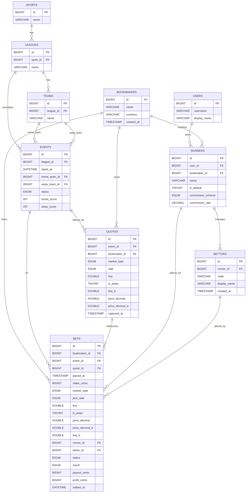

# Gigam Core Schema — ER (Mermaid)

```mermaid
erDiagram
  SPORTS {
    BIGINT id PK
    VARCHAR name
  }

  LEAGUES {
    BIGINT id PK
    BIGINT sport_id FK
    VARCHAR name
  }

  TEAMS {
    BIGINT id PK
    BIGINT league_id FK
    VARCHAR name
  }

  USERS {
    BIGINT id PK
    VARCHAR username
    VARCHAR display_name
  }

  BOOKMAKERS {
    BIGINT id PK
    VARCHAR name
    VARCHAR currency
    TIMESTAMP created_at
  }

  RUNNERS {
    BIGINT id PK
    BIGINT user_id FK
    BIGINT bookmaker_id FK
    VARCHAR name
    TINYINT is_default
    ENUM commission_scheme
    DECIMAL commission_rate
  }

  BETTORS {
    BIGINT id PK
    BIGINT runner_id FK
    VARCHAR code
    VARCHAR display_name
    TIMESTAMP created_at
  }

  EVENTS {
    BIGINT id PK
    BIGINT league_id FK
    DATETIME starts_at
    BIGINT home_team_id FK
    BIGINT away_team_id FK
    ENUM status
    INT home_score
    INT away_score
  }

  QUOTES {
    BIGINT id PK
    BIGINT event_id FK
    BIGINT bookmaker_id FK
    ENUM market_type
    ENUM side
    DOUBLE line
    TINYINT is_asian
    DOUBLE line_b
    DOUBLE price_decimal
    DOUBLE price_decimal_b
    TIMESTAMP captured_at
  }

  BETS {
    BIGINT id PK
    BIGINT bookmaker_id FK
    BIGINT event_id FK
    BIGINT quote_id FK
    TIMESTAMP placed_at
    BIGINT stake_cents
    ENUM market_type
    ENUM pick_side
    DOUBLE line
    TINYINT is_asian
    DOUBLE price_decimal
    DOUBLE price_decimal_b
    DOUBLE line_b
    BIGINT runner_id FK
    BIGINT bettor_id FK
    ENUM status
    ENUM result
    BIGINT payout_cents
    BIGINT profit_cents
    DATETIME settled_at
  }

  SPORTS ||--o{ LEAGUES : has
  LEAGUES ||--o{ TEAMS : has
  LEAGUES ||--o{ EVENTS : schedules
  TEAMS ||--o{ EVENTS : home_team
  TEAMS ||--o{ EVENTS : away_team

  USERS ||--o{ RUNNERS : owns
  BOOKMAKERS ||--o{ RUNNERS : employs

  RUNNERS ||--o{ BETTORS : manages

  EVENTS ||--o{ QUOTES : offered_for
  BOOKMAKERS ||--o{ QUOTES : posts

  BOOKMAKERS ||--o{ BETS : takes
  EVENTS ||--o{ BETS : on
  QUOTES ||--o{ BETS : references
  RUNNERS ||--o{ BETS : places_for
  BETTORS ||--o{ BETS : placed_by
```
